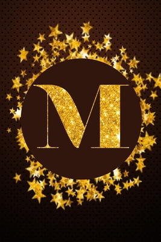

---
# You don't need to edit this file, it's empty on purpose.
# Edit theme's home layout instead if you wanna make some changes
# See: https://jekyllrb.com/docs/themes/#overriding-theme-defaults
layout: home
---

<!-- 

    

        
    
 -->

    

    
Hello there, greetings to you.

    

    

    I am Morad and essentially I use this site to extend some of the things which I work on and create to a public audience, with the hopes that I might achieve a few goals I have set for myself, among which include:
    

    <ol>
    <li>
    Documenting and reflecting on programming projects I undertake, with the main focus being on the learning experience itself;
    </li>
    <li>
    Housing a convenient and demonstrative record of my skillsets and motives to help give a feel of what I am typically like as a person when I am working on projects;
    </li>
    <li>
    Having fun expressing whatever creativity I can harness in myself to design and deliver more engaging, efficient and attractive alternative solutions to problems I have had to tackle through my own independent research and engineering.
    </li>
    </ol>
    <!-- 
 -->
    

    As for my occupation at the moment, in a nutshell, I am a software engineering student (third year) at the University of Glasgow.
    

    

    For a more in-depth grounding about me and what I'm currently cooking up, check out the About page. With that said, I now leave you to explore the rest of the site as you like. May you profit from what you discover.
    

<!-- 
 -->
